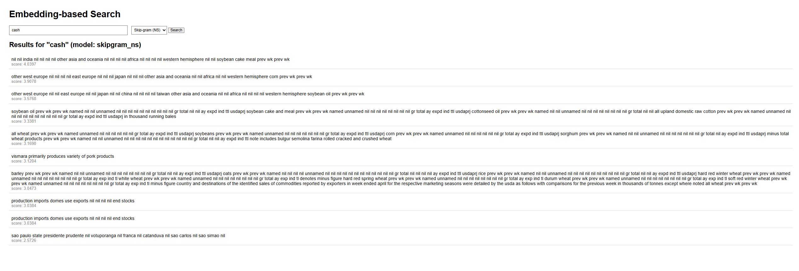
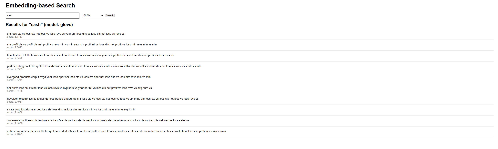

## Web Demo Overview

This repository contains a simple **embedding-based search** web application built with Flask. [dev](https://dev.to/edenai/build-your-own-search-engine-api-with-flask-and-eden-ai-embeddings-57ml)
Users can type a free-text query and retrieve the most relevant Reuters‑style financial sentences based on word embeddings. [geeksforgeeks](https://www.geeksforgeeks.org/nlp/word-embeddings-in-nlp/)

## Available Models

The app supports two embedding models for the search:

- **Skip-gram (negative sampling)**: Trained Word2Vec Skip-gram model (`skipgram_ns`) that focuses on predicting surrounding context words for a given center word. [pmc.ncbi.nlm.nih](https://pmc.ncbi.nlm.nih.gov/articles/PMC8391962/)
- **GloVe**: Pre-trained GloVe embeddings that learn word vectors from global word–cooccurrence statistics. [geeksforgeeks](https://www.geeksforgeeks.org/nlp/word-embeddings-in-nlp/)

On the web interface, you can choose the model from a dropdown menu:

- `glove`  
- `skipgram_ns`

The current selection is preserved when you submit a new query.

## How to Run

From the assignment folder:

```bash
cd "C:\Users\Legion 5 Pro\OneDrive\Documents\NLP\assignment\NLP_A1"

# Prepare context embeddings (only needed the first time)
python prepare_context_embeddings.py

# Run the Flask app
python app.py
```

Then open:

```text
http://127.0.0.1:5000/
```

Type your query, choose either **Skip-gram** or **GloVe**, and press **Search**.

## Example Screenshots

### Skip-gram → query: `cash`



### GloVe → query: `cash`



These examples show how different embedding models retrieve slightly different but still semantically related financial sentences for the same query. [machinelearningmastery](https://machinelearningmastery.com/example-applications-of-text-embedding/)